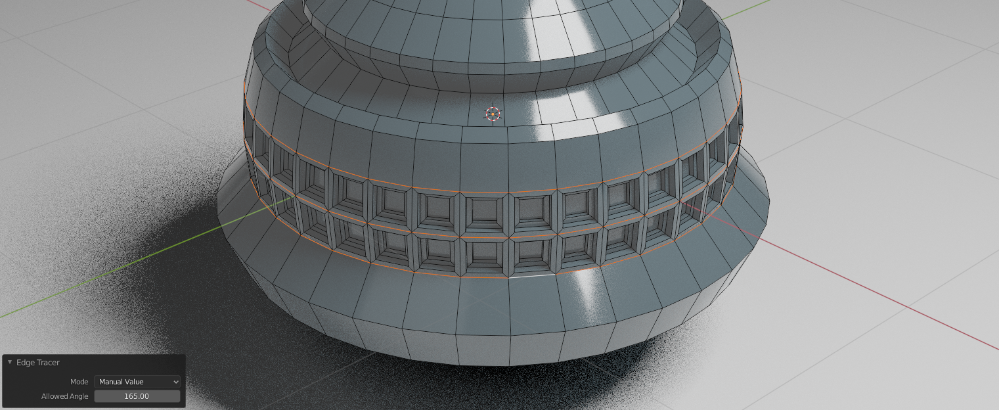
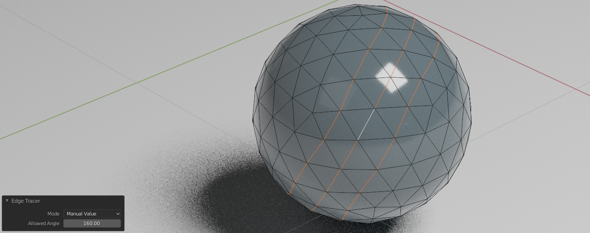

# AngleBased-EdgeTracer Add-on

An edge loop selection tool for edge cases.
Select edge loops in non-quad messy geometries.

## Blender Support

This add-on has been developed to work with blender 3.1.2+.

## About

This add-on works in "Edit Mode" while using "Edge Select".
Just make sure the edge you want to trace is active and press the "Shift + T" shortcut.
You can use the menu to adjust the minimum allowed angle between edges in a path.

## Examples

